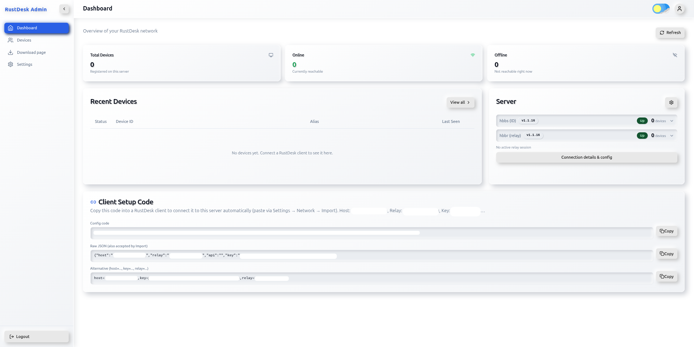
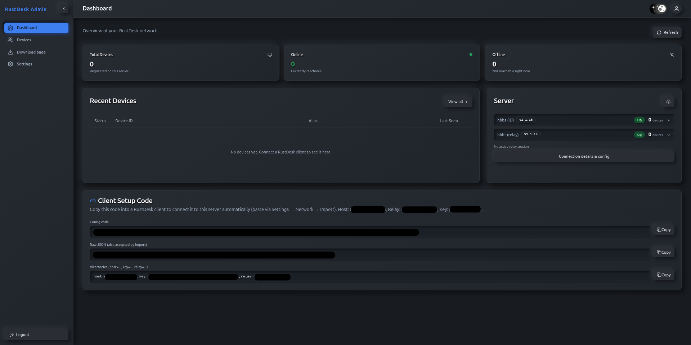

# RustDesk Admin

<p align="center">
  [<a href="docs/README-RU.md">Русский</a>] | [<a href="docs/README-ZH.md">中文</a>] | [<a href="docs/README-AR.md">العربية</a>]<br>
</p>

A single mono-repo for deploying a fully containerized **RustDesk server** with a
web admin console: ID server + relay server + admin panel + live device presence +
automatic Let's Encrypt TLS — all in one Docker Compose project. The host only needs
**Docker** — no systemd units, no host certbot, no host nginx.

Everything is restart-agnostic: `docker compose restart`, a server reboot, or
re-running `./setup.sh` never lose state or settings.

> This project was written entirely by an AI coding assistant — there is no
> hand-written code in this repository.

```
rustdesk-stack/
├── docker-compose.yml         # 8 services, one network
├── docker-compose.dev.yml     # optional overlay: air hot-reload + vite dev server
├── setup.sh                   # first-run bootstrap (idempotent)
├── .env.example               # template; copy to .env
├── Makefile                   # helper commands (dev/build/logs/db ...)
├── backend/                   # Go admin API (compiled into a small prod image)
├── frontend/                  # React admin UI (static nginx / SPA)
├── nginx/nginx.conf.template  # ${DOMAIN} + ACME webroot + WSS termination
├── presence/Dockerfile        # presence poller (docker.sock + nsenter)
├── scripts/presence.sh        # live connection snapshot (hbbs/hbbr namespaces)
├── data/                      # LIVE DATA - created by setup.sh:
│   ├── hbbs/                  #   hbbs/hbbr key (id_ed25519) + device DB (sqlite)
│   ├── postgres/              #   Postgres data dir (bind mount)
│   └── certbot/etc/           #   Let's Encrypt live/archive/renewal
└── status/                    # presence.json (written by the presence container)
```

`data/` and `status/` are git/tar-ignored and never ship in the archive.

## Screenshots

| Light theme                                                  | Dark theme                                                 |
|--------------------------------------------------------------|------------------------------------------------------------|
|    |    |

---

## Table of contents

- [Functionality](#functionality)
- [Architecture / services](#architecture--services)
- [Prerequisites](#prerequisites)
- [Install from scratch](#install-from-scratch)
- [Ports and `.env` configuration](#ports-and-env-configuration)
- [Certificates (Let's Encrypt)](#certificates-lets-encrypt)
- [Server Info](#server-info)
- [RustDesk web client](#rustdesk-web-client)
- [Client setup code](#client-setup-code)
- [Development mode (dev overlay)](#development-mode-dev-overlay)
- [Download sources and mirrors (Block C)](#download-sources-and-mirrors-block-c)
- [Docker cleanup after build (Block D)](#docker-cleanup-after-build-block-d)
- [Backup and migration](#backup-and-migration)
- [Updating](#updating)
- [Troubleshooting](#troubleshooting)
- [API (reference)](#api-reference)

---

## Functionality

- **Web admin console** (React SPA + Go API):
  - Dashboard — server status summary, live presence.
  - Devices — list of registered devices (`GET /api/devices`), view details, delete.
  - Settings — panel settings (seeded from `.env`, then owned by the DB);
    session lifetime is also configurable here.
  - Login = JWT access + refresh tokens with server-stored sessions; sessions
    are rotated and pruned as refresh tokens expire; change admin credentials.
- **Live presence** (`presence` container):
  - reads real hbbs/hbbr connections directly from their network namespaces
    (nsenter + `ss` + docker.sock);
  - writes `status/presence.json` with active peer IPs, listening-port state, and
    peer→IP bindings;
  - status is also aggregated by the backend and exposed via `/api/status`.
- **RustDesk server**: hbbs (ID) + hbbr (relay) from the official
  `rustdesk/rustdesk-server:1.1.16` image; key and device DB live in `data/hbbs/`.
- **Zero-config TLS**: self-managed Let's Encrypt (webroot), auto-renew every 12h,
  plus nginx WSS termination on ports 21118/21119 for RustDesk TCP-mux.
- **Server Info with sources**: clients/web client read address/ports/key from
  `GET /api/server-info` — each field reports where it came from
  (env/setting/stack).
- **CORS for the RustDesk web client**: headers allow the rustdesk.com web client.

---

## Architecture / services

| Service  | Image                                        | Purpose                                              |
|----------|----------------------------------------------|------------------------------------------------------|
| postgres | postgres:16-alpine                           | panel DB (`./data/postgres`), migrations on boot     |
| backend  | built (`backend/Dockerfile`, prod stage)     | REST API + WebSocket + presence reader               |
| frontend | built (`frontend/Dockerfile`, prod stage)    | admin UI (static nginx / SPA)                        |
| nginx    | nginx:alpine                                 | HTTPS panel, ACME webroot, WSS 21118/21119           |
| hbbs     | rustdesk/rustdesk-server:1.1.16              | ID server (`-r ${DOMAIN}:21117`)                     |
| hbbr     | rustdesk/rustdesk-server:1.1.16              | relay server                                         |
| presence | built (`presence/Dockerfile`)                | namespace polling → `status/presence.json`           |
| certbot  | certbot/certbot                              | issues on first run, renews every 12h                |

All containers use `restart: unless-stopped` — they come back automatically after
an OS reboot or Docker restart.

---

## Prerequisites

- Docker Engine + Docker Compose v2:
  ```
  apt update && apt install -y docker.io docker-compose-v2
  systemctl enable --now docker
  ```
- A public domain pointing (DNS A record) to this server.
- Free TCP ports: `80`, `443`, `21115`–`21119` (+ UDP `21116`, `21117`);
  all remappable via `.env` (see below).
- By default the backend/frontend images are small (≈50 MB / a few MB).
  The dev overlay needs a few GB of disk and ~2 GB RAM.
- Recommendation for cheap hardware (like 1.9G RAM / 8.7G disk): add a swap file
  before building (builds consume RAM) and keep an eye on free disk space.

Example firewall (ufw):

```
ufw allow 22/tcp
ufw allow 80/tcp
ufw allow 443/tcp
ufw allow 21115/tcp
ufw allow 21116/tcp
ufw allow 21116/udp
ufw allow 21117/tcp
ufw allow 21117/udp
ufw allow 21118/tcp
ufw allow 21119/tcp
ufw enable
```

---

## Install from scratch

```
git clone https://github.com/pierce1stg/RustDeskAdmin.git
cd RustDeskAdmin

cp .env.example .env
# edit .env: DOMAIN=<your-hostname>, LETSENCRYPT_EMAIL=<your-email>
./setup.sh
```

Before running, check that `DOMAIN` resolves (A record) to this server's public IP
and that port 80 is reachable from the internet — the Let's Encrypt HTTP-01 challenge
is served through it by nginx. If the first run prints a **"placeholder certificate"**
warning and nothing else looks wrong, fix DNS/firewall and simply re-run `./setup.sh` —
it is idempotent and retries the issuance with the same domain.

### Generate secrets yourself (optional)

`setup.sh` fills empty/`changeme` secrets automatically (see Block A below). To pick
them yourself, run:

```
POSTGRES_PASSWORD=$(openssl rand -base64 32)
JWT_SECRET=$(openssl rand -base64 32)
JWT_REFRESH_SECRET=$(openssl rand -base64 32)
```

...and put the values into `.env`. Leaving them as `changeme` is fine — the script
replaces them with random values on the first run.

`setup.sh` (idempotent) will:

1. generate `POSTGRES_PASSWORD`, `JWT_SECRET`, `JWT_REFRESH_SECRET` if empty/`changeme`;
2. create `data/` and `status/`;
3. put a self-signed placeholder into `data/certbot/etc/live/<DOMAIN>` so nginx
   always boots with TLS;
4. `docker compose up -d --build`;
5. wait for hbbs to create `data/hbbs/db_v2.sqlite3`;
6. issue the real Let's Encrypt certificate via HTTP-01 webroot on port 80
   (`--cert-name <DOMAIN>`) and reload nginx immediately;
7. print the summary.

Re-run `./setup.sh` any time to (re)build, (re)create containers, or (re)issue a cert.

### First login

Admin credentials are seeded from the `.env` Block B
(`ADMIN_USERNAME`/`ADMIN_PASSWORD`, defaults `admin`/`admin`).
**Change the password immediately** in the panel (Settings → Admin credentials).
The password must be at least 8 characters (validated by the backend).

---

## Ports and `.env` configuration

### Block A (required / secrets)

| Variable             | Description                                        |
|----------------------|----------------------------------------------------|
| `DOMAIN`             | public hostname (DNS A → this host)                |
| `LETSENCRYPT_EMAIL`  | email for LE notifications (renewals)              |
| `POSTGRES_PASSWORD`  | Postgres password (auto-generated if `changeme`)   |
| `JWT_SECRET`         | API JWT signing secret (auto-generated)            |
| `JWT_REFRESH_SECRET` | refresh-token secret (auto-generated)              |

### Block B (one-time seeds — the panel owns settings afterwards)

`ADMIN_USERNAME`, `ADMIN_PASSWORD`, `STATUS_REFRESH_INTERVAL` (30s),
`SERVER_DISPLAY_ADDRESS` (optional override), `RUSTDESK_PUBLIC_KEY` (optional; on a
fresh stack hbbs generates the key in `data/hbbs`), `RUSTDESK_ID_PORT`,
`RUSTDESK_RELAY_PORT`, `RUSTDESK_WS_PORT`, `ACCESS_TOKEN_TTL_MINUTES` (60),
`REFRESH_TOKEN_TTL_DAYS` (7), `RUSTDESK_SERVER_VERSION` (1.1.16, compose pin for
hbbs/hbbr), `ALLOW_SERVER_UPDATE` (true, enables the panel's Server updates card).

### Session lifetime (JWT TTL)

Access tokens gate every API call; refresh tokens keep the browser session alive
and are rotated on every refresh. Both are configurable — re-seeded from `.env`
on a fresh stack and editable any time in **Settings → Session**:

| Setting                    | Default | Allowed range | Meaning                                     |
|----------------------------|---------|---------------|---------------------------------------------|
| `ACCESS_TOKEN_TTL_MINUTES` | 60      | 5..10080      | access token validity (minutes)             |
| `REFRESH_TOKEN_TTL_DAYS`   | 7       | 1..365        | how long an idle session stays alive (days) |

Sessions are stored server-side in `auth_sessions` (postgres), so an active login
survives backend restarts and redeploys. Changing a TTL affects only tokens issued
after that point; already-issued tokens run out at their natural expiry, after
which the panel simply asks to sign in again.

### Host port mapping (all optional, defaults shown)

| Variable         | Default | Meaning                                  |
|------------------|---------|------------------------------------------|
| `HTTP_PORT`      | 80      | ACME webroot / HTTP→HTTPS                |
| `HTTPS_PORT`     | 443     | admin panel TLS                          |
| `NAT_PORT`       | 21115   | hbbs (NAT/heartbeat)                     |
| `ID_PORT`        | 21116   | hbbs ID server (tcp+udp)                 |
| `RELAY_PORT`     | 21117   | hbbr relay (tcp+udp)                     |
| `WSS_ID_PORT`    | 21118   | WSS → hbbs (nginx TLS termination)       |
| `WSS_RELAY_PORT` | 21119   | WSS → hbbr (nginx TLS termination)       |
| `API_PORT`       | 8080    | backend port exposed on the host (debug) |

Inside the containers the listening ports are fixed; only the host mapping is
parameterized. Example: if another service owns host port 443, set
`HTTPS_PORT=8443`.

---

## Certificates (Let's Encrypt)

- Bootstrap: self-signed placeholder → the stack always starts with TLS.
- Issuance: HTTP-01 webroot. Requires host port `80` (see `HTTP_PORT`) and inbound
  TCP/UDP. If `HTTP_PORT != 80`, the auto-issue is skipped (set it to 80, or run
  certbot manually).
- Renewal: the `certbot` container runs `certbot renew --quiet` every 12h; nginx
  self-reloads every 6h to pick up new certs (no docker CLI inside certbot).

The `--cert-name <DOMAIN>` flag makes certbot write to
`data/certbot/etc/live/<DOMAIN>`, which is what the nginx template reads.

---

## Server Info

`GET /api/server-info` returns each field with its **source**:

| Field          | Sources (priority)                                              |
|----------------|-----------------------------------------------------------------|
| address        | manual override → `DOMAIN` env → request Host                   |
| relay address  | manual override → `RELAY_ADDRESS` env → same as address         |
| api server     | manual override → `RUSTDESK_API_SERVER` env → empty (unused)    |
| ports          | manual override → env seeds → stack defaults                    |
| public key     | manual override → `data/hbbs/id_ed25519.pub`                    |

Clients/web client use these values; on a fresh stack hbbs creates the key on first
start and the backend picks it up automatically (`rustdesk-server` source).

---

## RustDesk web client

To connect via the web client (https://rustdesk.com/web), point Server Info in the
panel at your `DOMAIN` and ports, and use the key from the panel. CORS headers in
nginx allow the `rustdesk.com`/`web.rustdesk.com` origins.

---

## Client setup code

The Dashboard shows a ready-to-distribute **Client Setup Code** built from the
current Server Info (`GET /api/server-info/connect-code`). Copy the **Config code**
into a RustDesk client and paste it into **Settings → Network → Import** — the
client applies the ID/relay server, optional API server and key automatically:

| Form | Example |
|------|---------|
| Config code | `=0nI9smcPhWR0YVcz1mekllS3JDbVNm...` — reversed base64url (with padding) of the JSON `{"host","relay","api","key"}` |
| Raw JSON | `{"host":"<your-domain>","relay":"<your-domain>","api":"","key":"<your-public-key>"}` — also accepted by Import |
| Alternative | `host=<your-domain>,key=<your-public-key>,relay=<your-domain>` |

The code is **unsigned**: the client decoder (`ServerConfig.decode` in
`flutter/lib/common.dart`) tries the raw JSON first, then the reversed-base64url
form — both are produced by the backend. The signed form used by the hosted web
console cannot be reproduced here (its signing key is private). Non-default
ID/relay ports are embedded as `host:port` in the matching field. Hosts may be a
domain, an IPv4 address or a bracketed IPv6 address; the API server value, when
set, must be a full `http(s)://` URL.

---

## Development mode (dev overlay)

Hot reload with air + Vite dev server (larger images, needs disk/RAM):

```
docker compose -f docker-compose.yml -f docker-compose.dev.yml up -d --build
```

The frontend dev server listens on host port `5173`. The backend runs under `air`
and rebuilds on file changes.

---

## Download sources and mirrors (Block C)

All external downloads of the stack go through a few well-defined sources that can
be redirected manually from `.env` (see the `Block C` section of `.env.example`).
Reapply after changing: re-run `./setup.sh` (or `docker compose build`).

| Traffic                      | Overridable by        | Default source                                   |
|------------------------------|-----------------------|--------------------------------------------------|
| Docker images (runtime + base `FROM` images) | `DOCKER_REGISTRY_PREFIX` | Docker Hub (e.g. `postgres:16-alpine`)     |
| Go modules + `air` tool      | `GOPROXY`             | `https://proxy.golang.org,direct`                |
| npm packages (frontend)      | `NPM_REGISTRY`        | `https://registry.npmjs.org`                     |
| Alpine apk packages          | `APK_MIRROR`          | `https://dl-cdn.alpinelinux.org/alpine`          |

Examples:

```
# Pull everything through a private registry
DOCKER_REGISTRY_PREFIX=registry.example.com/

# Use a Go module proxy mirror (China / restricted networks)
GOPROXY=https://goproxy.cn,direct

# Use an npm registry mirror
NPM_REGISTRY=https://registry.npmmirror.com

# Use an Alpine mirror (keeps the /v3.xx paths, only the host is swapped)
APK_MIRROR=https://mirror.example.com/alpine
```

Notes:
- Leave the variables empty to keep the official sources.
- `DOCKER_REGISTRY_PREFIX` is prepended to every image reference (both `image:` in
  compose and `FROM` in the Dockerfiles), including the builder/base images.
- `APK_MIRROR` replaces only the host
  `https://dl-cdn.alpinelinux.org/alpine` inside the built images, so the
  `/v3.xx/{main,community}` paths always match the base image's Alpine version.
- Failover is manual: Docker never auto-switches to a mirror. Set the values up
  front on hosts with restricted network access.

---

## Docker cleanup after build (Block D)

`./setup.sh` prunes unused Docker resources at the end (see `Block D` of
`.env.example`) so builds don't leave the disk full — important on small VPS.

| `DOCKER_PRUNE_ON_BUILD` | What is removed                                          |
|-------------------------|----------------------------------------------------------|
| `all` (default)         | every image not used by a running container (base build images like `golang`/`node`/`python` alpine get re-pulled on the next rebuild), stopped one-shot containers, unused networks/volumes |
| `safe`                  | only dangling images + build cache                       |
| `none`                  | no cleanup                                               |

What is never touched: the images the running stack actually uses
(`rustdesk-stack-*`, `postgres`, `nginx`, `certbot`, `rustdesk-server`) and the
`data/` volume. If `all` removed base build images, the next `./setup.sh`
re-downloads them (~500 MB). On a tight disk, running
`docker image prune -a -f` before re-running `./setup.sh` also helps if a rebuild
ran out of space mid-way.

---

## Backup and migration

**All state lives inside `rustdesk-stack/`:**

- **Server identity + devices**: `data/hbbs/` (keep `id_ed25519*` and
  `db_v2.sqlite3*`). Fresh installs only if you don't care about the key/devices.
- **Admin panel DB**: `data/postgres/` — copy it **after stopping the stack**
  (`docker compose stop postgres`). The `POSTGRES_PASSWORD` in `.env` MUST stay the
  same, it is embedded in the copied cluster roles.
- **TLS**: `data/certbot/etc/` (`cp -a` to preserve symlinks).

### Moving to a production host

```
# old host
docker compose stop postgres
mkdir -p ~/rustdesk-migrate && cp -a rustdesk-stack/data ~/rustdesk-migrate/data
tar czf ~/rustdesk-migrate/data.tgz -C ~/rustdesk-migrate data

# new host
git clone https://github.com/pierce1stg/RustDeskAdmin.git && cd RustDeskAdmin
cp .env.example .env            # set DOMAIN, EMAIL, same POSTGRES_PASSWORD
mkdir -p data && tar xzf ~/rustdesk-migrate/data.tgz -C .
./setup.sh
```

Or use `pg_dump`/restore for the panel DB if you prefer an SQL dump.

---

## Updating

Two independent parts update differently.

### Admin panel (backend / frontend / nginx / presence)

There is no in-panel self-update. Pull the code and re-run the idempotent bootstrap:

```
git pull
./setup.sh        # rebuilds the custom images, keeps .env and data/
```

State (server key, devices, admin DB, TLS certificates) lives in `data/` and `.env`
and is never touched by `./setup.sh`. Sessions in `auth_sessions` survive redeploys.
If your clone predates a history rewrite, `git pull` may fail with "unrelated
histories" — clone fresh and move `.env`, `data/` and `status/` into the new checkout
instead, then run `./setup.sh`.

### RustDesk server (hbbs / hbbr)

Two ways to update the relay to a newer release:

1. **Inline (panel)**: Settings → Server updates → check for a release and apply. It
   pulls the image and recreates the running container (rolls back on failure). Gated
   by `ALLOW_SERVER_UPDATE` (default `true`).
2. **Persistent (compose pin)**: bump `RUSTDESK_SERVER_VERSION` in `.env` (default
   `1.1.16`) and re-run `./setup.sh`.

The panel's inline update is a live hot-swap: the next `docker compose up` /
`./setup.sh` recreates hbbs/hbbr from the pinned `RUSTDESK_SERVER_VERSION`. Use the
pin for the version you actually want to keep running.

---

## Troubleshooting

- **Disk full during builds**: the default production images are small; make sure
  nothing else fills the host. Add swap if RAM <2GB. Old build images accumulate in
  `/var/lib/containerd` — clean them:
  ```
  docker image prune -a -f; docker system prune -f
  ```
- **hbbr crash-looping**: `docker compose logs hbbr` — usually a port conflict or a
  missing `/data` (bind `./data/hbbs`).
- **Certificate issuance fails / nginx "cannot load certificate"**: old builds moved the
  placeholder `live/<DOMAIN>` away for certbot, leaving a window where nginx could crash-loop
  and ACME saw "connection refused". `setup.sh` now keeps a plain placeholder at
  `live/<DOMAIN>` (nginx never loses it), issues the real certificate into a dedicated
  `live/<DOMAIN>-le` lineage and, on success, points `live/<DOMAIN>` at it with a symlink.
  A nginx healthcheck, a port-80 preflight and 3 retries make the first run just work.
- **presence.json empty**: ensure the `presence` container can see the docker socket
  (it needs `privileged` + `pid: host`, which the compose file provides) and that
  the `rustdesk-hbbs`/`rustdesk-hbbr` containers exist.
- **No internet module downloads**: the backend production image is built with
  `go mod vendor` and ships no module cache; the frontend image is a static bundle.
- **Login not working**: password must be ≥8 characters; after seeding, settings live
  in the DB — a `.env` change won't apply until you change it in the panel.
- **Logged out after a while / session kept dropping**: the panel signs you out once
  the access token expires and the refresh token can no longer keep the session
  alive. Adjust the lifetimes in **Settings → Session** (or re-seed them via
  `ACCESS_TOKEN_TTL_MINUTES` / `REFRESH_TOKEN_TTL_DAYS` on a fresh stack). Sessions
  are stored in postgres, so they survive backend restarts unless the data dir is
  wiped.

---

## API (reference)

| Method | Path                 | Description                                  |
|--------|----------------------|----------------------------------------------|
| POST   | `/api/auth/login`    | sign in, returns access+refresh JWT          |
| POST   | `/api/auth/refresh`  | refresh the access token                     |
| PUT    | `/api/auth/password` | change admin credentials (≥8 chars)          |
| GET    | `/api/devices`       | list devices (paginated)                     |
| PATCH  | `/api/devices/:id`   | update a device (alias, pinned)              |
| DELETE | `/api/devices/:id`   | delete a device                              |
| GET    | `/api/status`        | live hbbs/hbbr status + presence             |
| GET    | `/api/devices/stream` | SSE: live online/offline presence updates   |
| GET    | `/api/settings`      | settings                                     |
| PUT    | `/api/settings/:key` | update a setting                             |
| PUT    | `/api/settings/auth_access_token_ttl_minutes` | set access-token lifetime (minutes) |
| PUT    | `/api/settings/auth_refresh_token_ttl_days`   | set session lifetime (days)         |
| GET    | `/api/server-info`   | address/ports/key with sources               |
| GET    | `/api/server-info/connect-code` | client config code: `json` (reversed base64url), `raw` (JSON), `comma` (host=...) |
| GET    | `/health`            | health check                                 |

Auth: `Authorization: Bearer <access_token>`.
